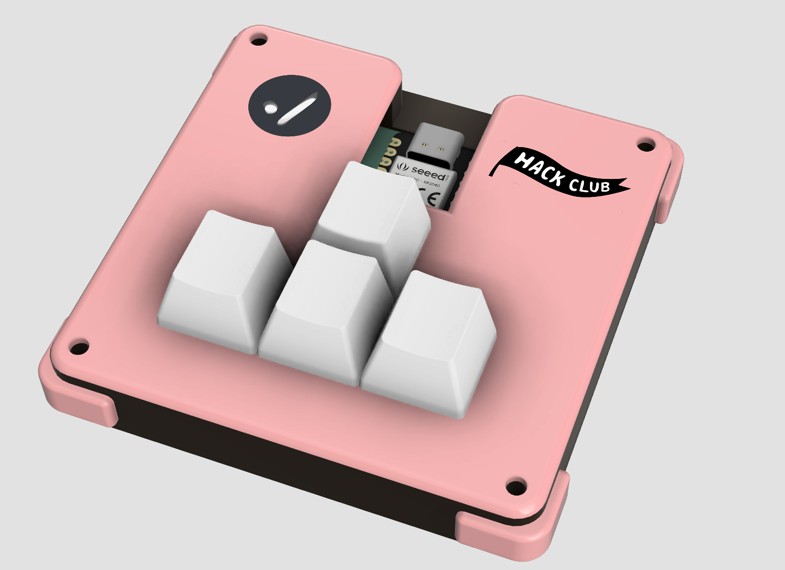
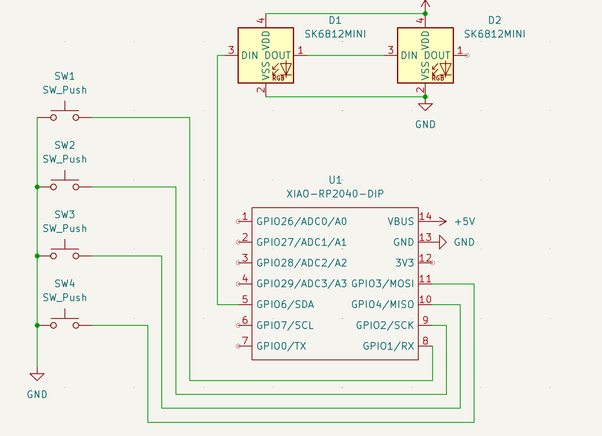
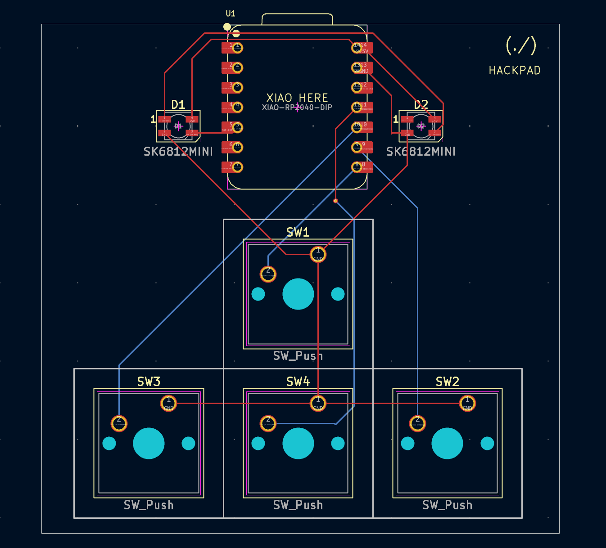
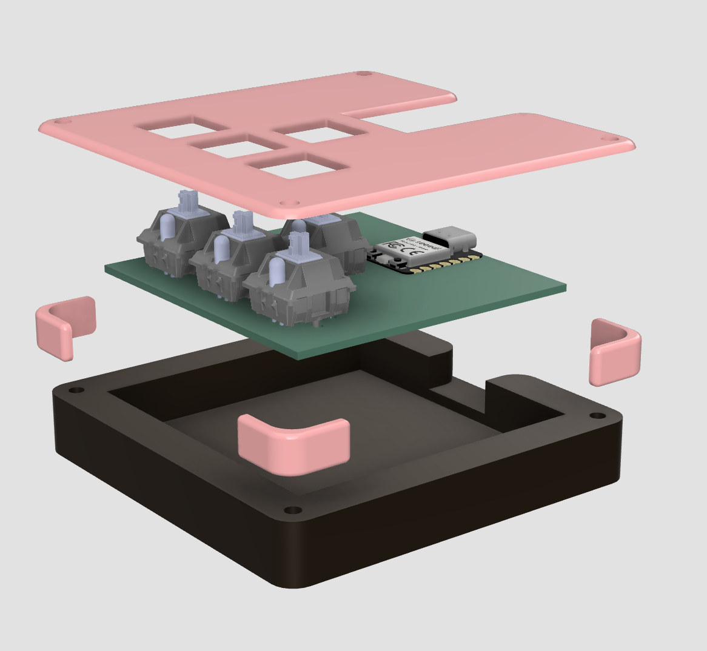
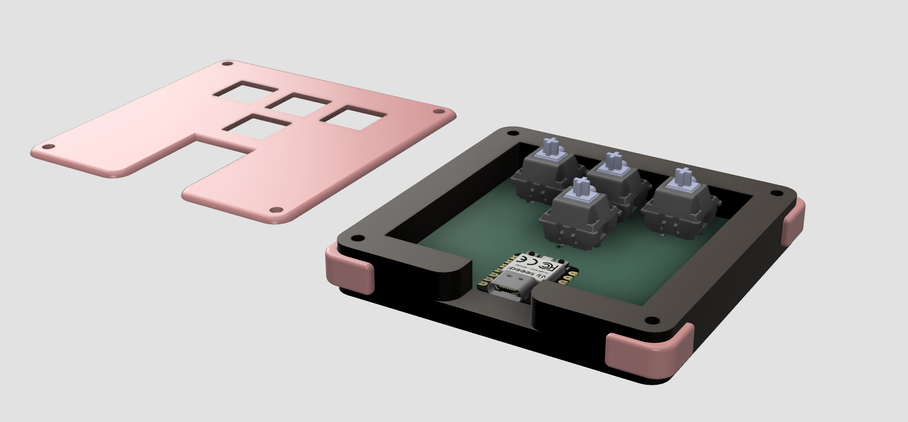

<h1><code>(./) hackpad</code></h1>
</img>

 

A macropad intended to make small laptop arrow keys more accessible, but I'm certainly open to experimenting with more complex firmware logic once I receive the parts :)

Designed with KiCad + Autodesk Fusion.

## PCB

<table><tbody><tr>
<td>

</td>
<td>

</td>
</tr></tbody></table>

## Case

> [!NOTE]
>
> The two logos shown in the full rendering at the top will be added on manually as stickers.

<table><tbody><tr>
<td>

</td>
<td>

</td>
</tr></tbody></table>

## BOM

|Qty | Item  | Note |
|----|-------|------|
| 1  | XIAO RP2040 | |
| 4  | Blank DSA keycaps | White preferred |
| 4  | Cherry MX switches | |
| 4  | M3x16mm screws | |
| 1  | PCB | |
| 1  | 3D printed bottom | Black |
| 4  | 3D printed sides | Pink preferred |
| 1  | 3D printed top | Pink preferred |
